"# FullStackCarOrderManagement" 

```
# Car Ordering API/Backend

A simple **ASP.NET Core Web API** project for managing car orders.  
This API allows customers to register, login, browse cars, place orders, and allows admin to manage cars and view orders.

---
```
## 🛠 Features

### Customer
- Register and Login (JWT authentication)
- Browse all cars
- Place orders
- View own orders

### Admin
- Add, update, delete cars
- View all orders
- Update order status

---

## ⚡ Technology Stack
- ASP.NET Core Web API
- Entity Framework Core
- SQL Server
- JWT Authentication
- C#

---

## 📦 Installation

1. Clone the repository:

```bash
git clone https://github.com/yourusername/car-order-api.git
Open the solution in Visual Studio.

Update appsettings.json with your SQL Server connection string and JWT key.

Apply migrations:

bash

Update-Database
Run the project.

🔑 JWT Configuration
json
Copy code
"Jwt": {
  "Key": "F3A9B8D1F6C34E71A9D4C2F1E8A7B6C2F9E1A4D7C3B9F1A8E6C2D4A7B8F1C9D2",
  "Issuer": "CarOrderApi",
  "Audience": "CarOrderClient"
}
🚀 API Endpoints
Auth
POST /api/auth/register - Register new user

POST /api/auth/login - Login and get JWT token

Cars
GET /api/cars - Get all cars

GET /api/cars/{id} - Get car by ID

POST /api/cars - Add new car (Admin only)

PUT /api/cars/{id} - Update car (Admin only)

DELETE /api/cars/{id} - Delete car (Admin only)

Orders
POST /api/orders - Place order (Customer)

GET /api/orders/my - Get own orders (Customer)

GET /api/orders - Get all orders (Admin)

PUT /api/orders/{id}/status - Update order status (Admin)
```
📸 Screenshots
```Registration```

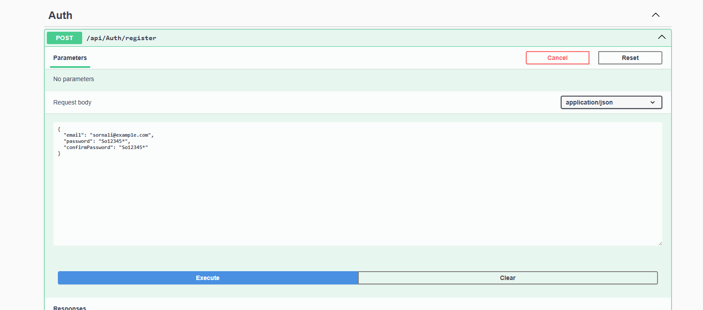

```Response```
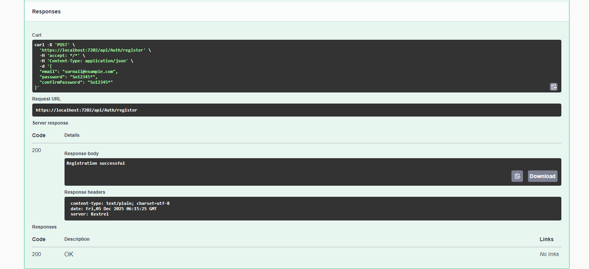

```Password Validation```

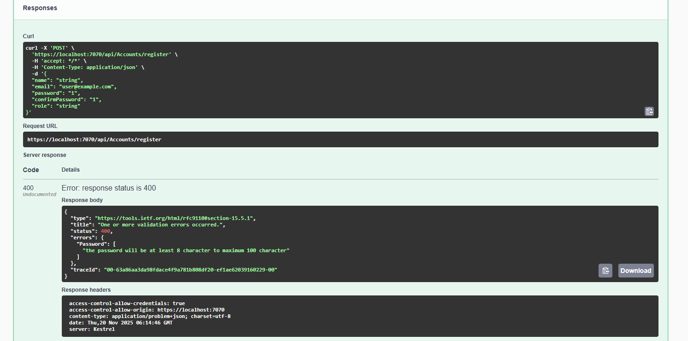

```Confirm password``` 

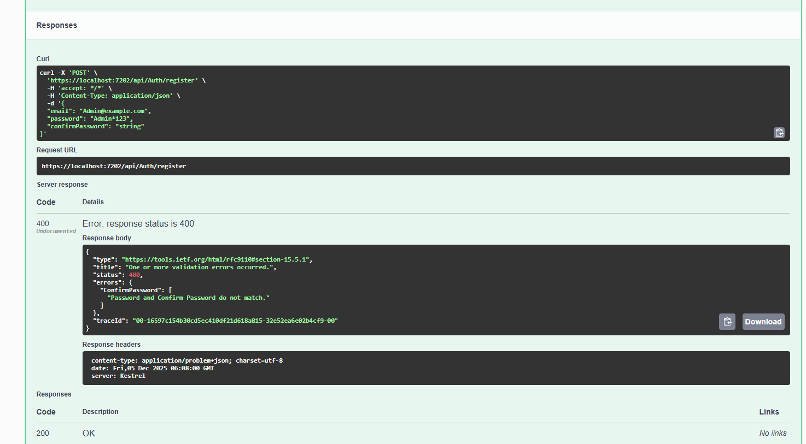

```Login```
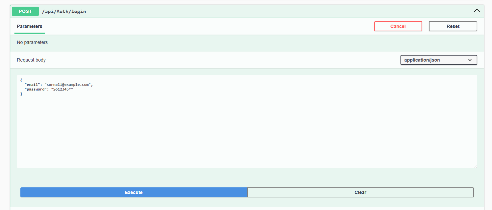

```login response```

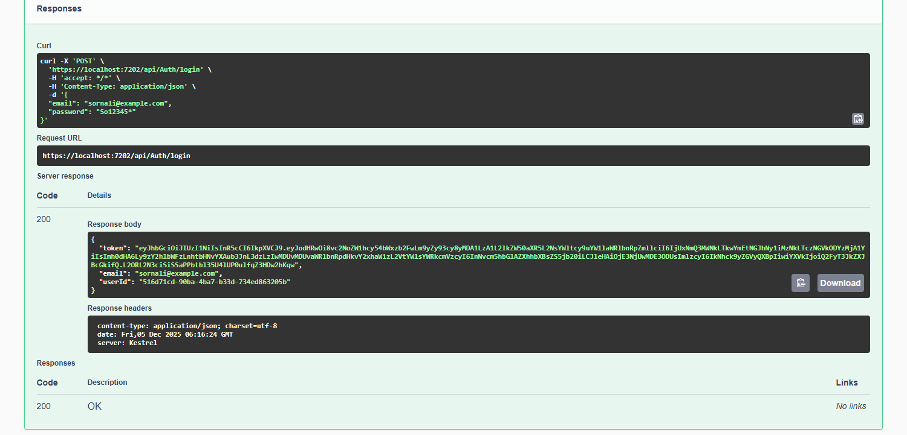


```logout response```

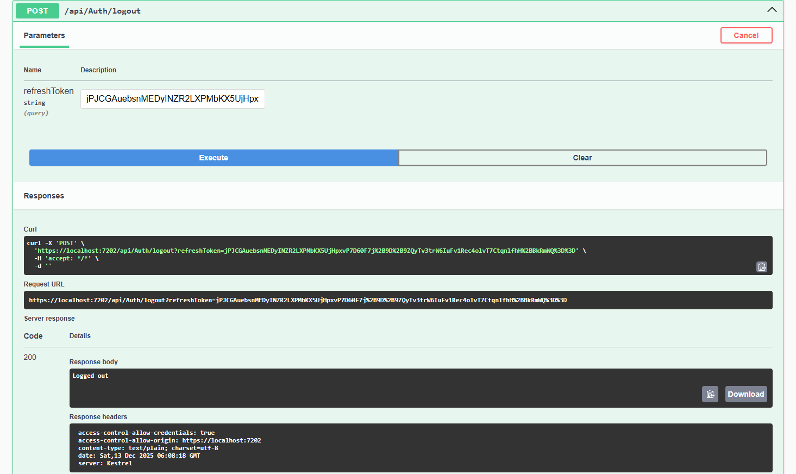

```Refresh token```

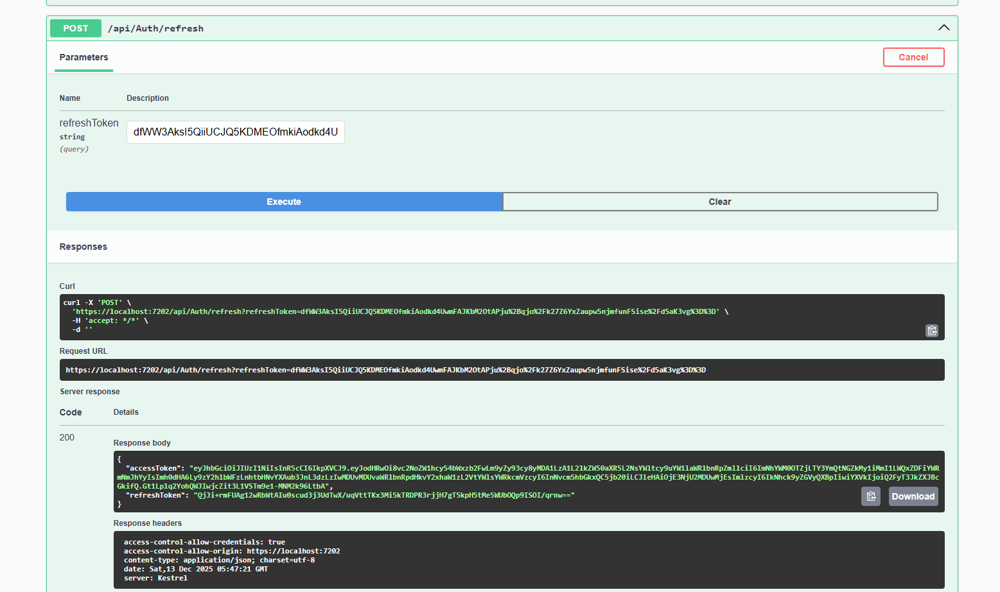


```Gat all Car```

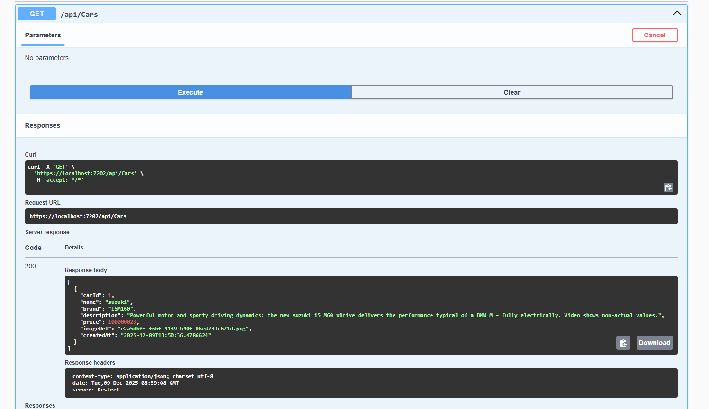

```Gat Car by ID```

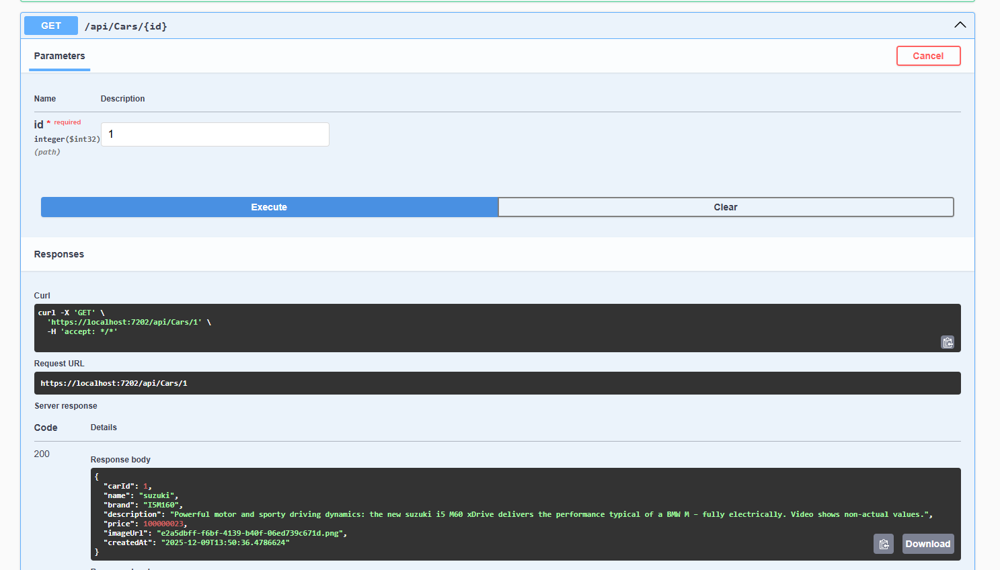

```Add new Car```

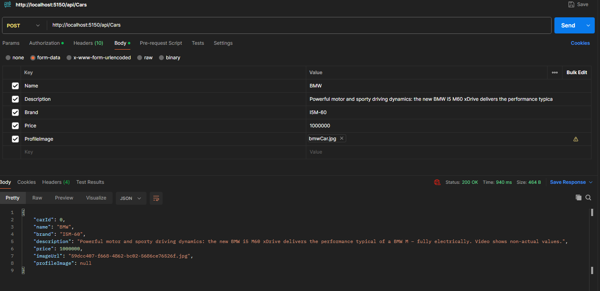

```get Image```


```Update car```

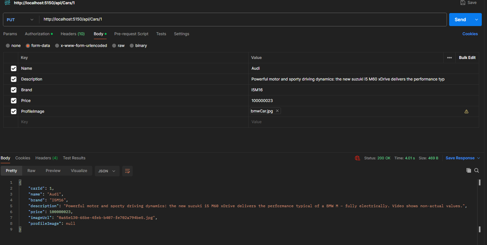


```Delate Car```

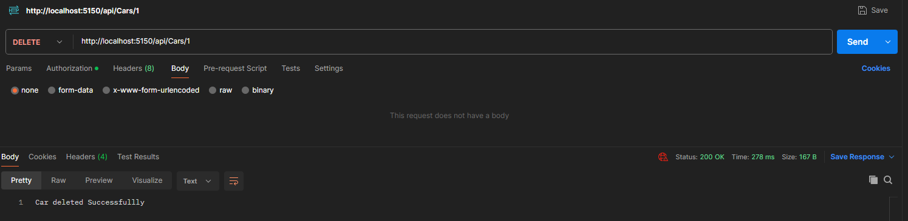

```
CarOrderClient/Frontend:

Angular Frontend project for managing car orders,customers to register, login, browse cars, place orders, and allows admin to manage cars and view orders. 
 
```

## ⚡ Technology Stack
- Angular 20
- Bootstrap
- Html
- CSS
- Typescript

📸 Screenshots
```Index Page```


```Login Frontend```


```Response with Jwt & refresh Token```
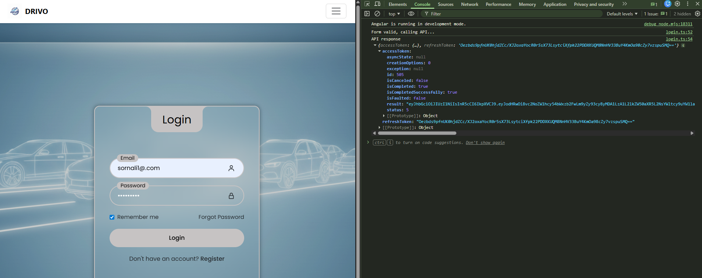

```Registration Frontend```
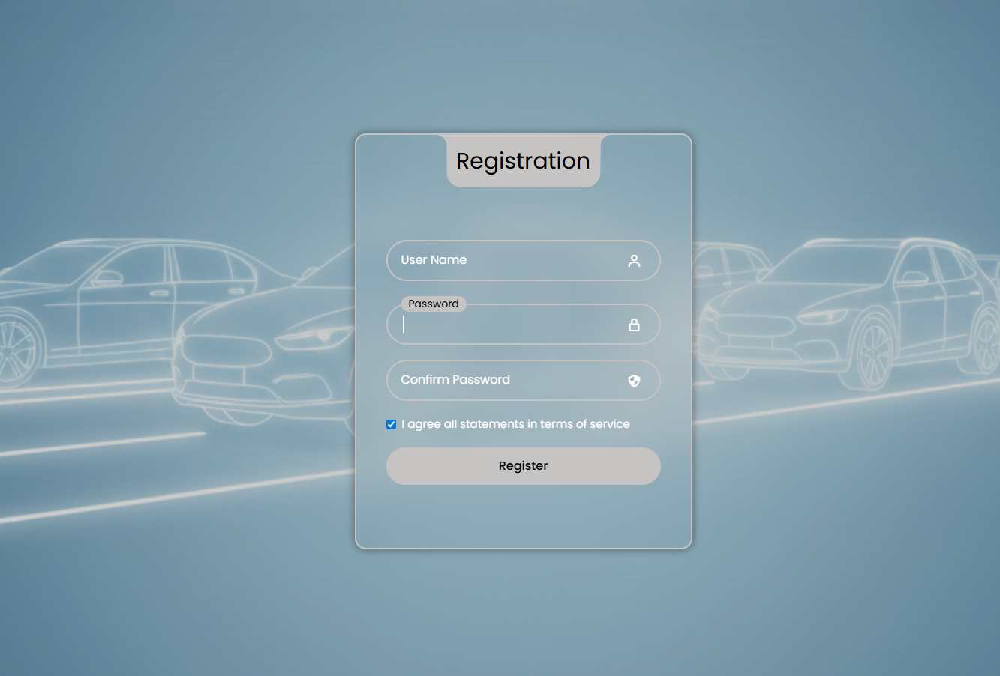

✅ License
MIT License
